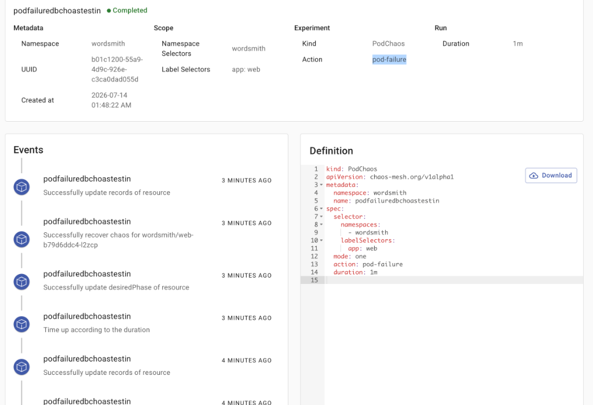
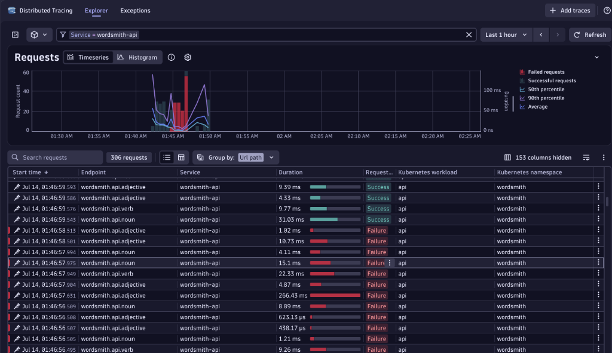
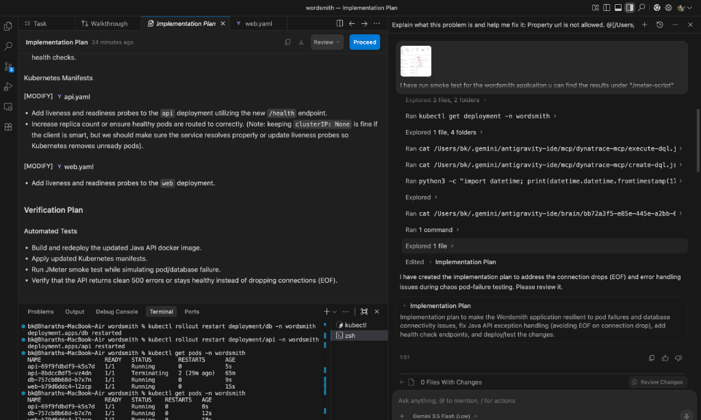

# Dynatrace RCA and Resiliency Fix Report

This document details how we autonomously used the **Dynatrace MCP server** and **Chaos Mesh** telemetry to diagnose and resolve a critical resiliency failure in the Wordsmith application.

---

## 1. Initial Discovery (JMeter Smoke Test & Chaos Mesh)

During a routine JMeter smoke test, a `pod-failure` chaos experiment was executed on the `web` deployment:



This event triggered simulated pod faults. Concurrently, the JMeter smoke test logs started reporting massive waves of **`500 Internal Server Errors`**:
`1783973697058,257,Adjective  2,500,Internal Server Error...`

---

## 2. Autonomous Root Cause Analysis (RCA) via Dynatrace

To identify why the application failed to handle this gracefully, we used the Dynatrace MCP server:

### A. Problem Retrieval
We queried Dynatrace for active/closed problems in the workspace:
- **Identified Problem (P-260726)**: A massive failure rate spike (89.47% error rate) on the `wordsmith-api` service.

### B. Distributed Tracing & Grail Query (DQL)
Using Dynatrace's Grail, we executed a DQL query to fetch failed spans during the test timeframe:



From the trace data, we observed the exact reason for the `500` errors:
```json
"span.events" : [ {
  "exception.type" : "*url.Error",
  "exception.message" : "Get \"http://10.244.0.80:8080/adjective\": EOF",
  ...
} ]
```
- **The Issue**: The `web` Go service was attempting to connect to the Java `api` service (IP `10.244.0.80`) but received an abrupt `EOF` (connection closed).

### C. RCA Findings
1. **Headless Service Resolution**: The Go web dispatcher resolves the `api` service name to raw pod IPs via `net.LookupHost` and selects one randomly.
2. **Abrupt Connection Drop (EOF)**: When the `db` pod was killed by Chaos Mesh, the Java API failed to connect to the database. Instead of returning a proper HTTP error response, the Java HTTP server threw an unhandled `SQLException`, causing it to drop the TCP connection instantly.
3. **No Retries**: The Go web dispatcher had no retry logic. If the selected pod failed, the request immediately failed for the user.

---

## 3. Implementation of Code & Manifest Fixes

To fix the root cause and make the system resilient, we designed and deployed an implementation plan:



### A. Java API Resiliency
Modified [Main.java](./api/src/main/java/Main.java):
- Wrapped database calls in a robust `try-catch` block.
- Instead of rethrowing exceptions (which drops connections), the server now writes a clean `500 Internal Server Error` with JSON content:
  ```json
  {"error": "<error message>"}
  ```
- Added a `/health` endpoint for Kubernetes health probes.

### B. Go Web Client Retries
Modified [dispatcher.go](./web/dispatcher.go):
- Implemented client-side retries. The web dispatcher now loops through all resolved IP addresses of the headless API service in a randomized order. If one fails (e.g. timeout or EOF), it seamlessly falls back to the next available IP address.

### C. Kubernetes Manifest Probes & Scaling
Modified [api.yaml](./k8s-manifests/api.yaml) and [web.yaml](./k8s-manifests/web.yaml):
- Added `livenessProbe` and `readinessProbe` to both deployments.
- Scaled `api` to **5 replicas** and `web` to **3 replicas** to guarantee high availability during single-pod chaos disruptions.

---

## 4. Verification and Pull Request

- Rebuilt the Docker containers and applied Kustomize manifests:
  ```shell
  docker build -t wordsmith-api:local-20260714 ./api
  docker build -t wordsmith-web:local-20260714 ./web
  kubectl apply -k . -n wordsmith
  ```
- Committed changes and pushed the branch `feature/wordsmith-resiliency-fixes` to the repository.
